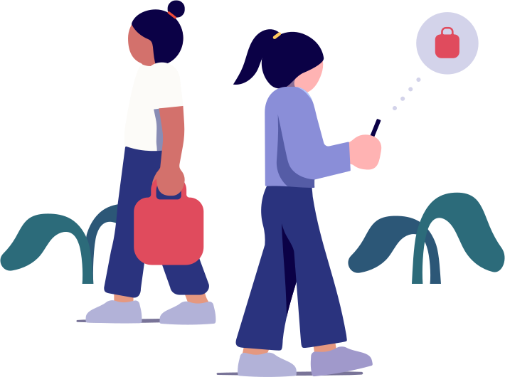

## II .En yakın komşu sınıflandırıcı

### En yakın komşu sınıflandırıcı, mümkün olan en basit sınıflandırıcılardan biridir. Sınıflandırılacak bir öğeye verildiğinde, yeni öğeye en çok benzeyen eğitim verisini bulur ve etiketini çıkarır. Aşağıdaki diyagramda bir örnek verilmiştir.

Yukarıdaki şemada, bazıları bir sınıfa (yeşil) ve diğerini diğer sınıfa (mavi) ait olan eğitim veri öğeleri koleksiyonu gösterilmektedir. Ek olarak, en yakın komşu yöntemini kullanarak sınıflandıracağımız yıldızlar olan iki test verisi maddesi vardır.

Her iki test maddesi de “yeşil” sınıfta sınıflandırılır, çünkü en yakın komşularının her ikisi de yeşildir (yukarıdaki şemaya (b) bakınız).

Grafikteki noktaların konumu, bir şekilde öğelerin özelliklerini temsil eder. Diyagramı iki boyutlu düz bir yüzeye çizdiğimiz için - iki bağımsız yöne hareket edebilirsiniz: yukarı-aşağı veya sol-sağ - öğeler karşılaştırma için kullanabileceğimiz iki özelliğe sahiptir. Örneğin, bir klinikteki hastaları, yaşları ve kan şekeri düzeyleri açısından temsil ettiğini düşünün. Ancak yukarıdaki diyagram, sınıf değerlerini benzerlik veya yakınlık (yakınlık) ile ilişkilendiren genel fikri göstermek için görsel bir araç olarak alınmalıdır. Genel fikir hiçbir şekilde iki boyutla sınırlı değildir ve en yakın komşu sınıflandırıcı ikiden daha fazla özellik ile karakterize edilen öğelere kolayca uygulanabilir.

### En yakın ile ne demek istiyoruz?

En yakın komşu sınıflandırıcısına (diğerlerinin yanı sıra) ilişkin ilginç bir soru, örnekler arasındaki mesafenin veya benzerliğin tanımıdır. Yukarıdaki çizimde teknik olarak Öklid mesafesi olarak adlandırılan standart geometrik mesafenin kullanıldığını varsaydıkça varsaydık. Bu sadece, eğer noktalar bir kağıda çizilirse (veya ekranınızda görüntüleniyorsa), bir iplik parçasını birinden diğerine doğrudan çekerek ve uzunluğu ölçerek iki öğe arasındaki mesafeyi ölçebileceğiniz anlamına gelir.

Not

## 'En yakın' tanımı

Hangisinin en yakın öğe olduğuna karar vermek için geometrik mesafenin kullanılması her zaman makul ve hatta mümkün olmayabilir: örneğin girdi türü metinlerin, öğelerin geometrik bir gösterimle nasıl çizildiğinin ve mesafelerin nasıl netleştirilmediğinin açık olmadığı durumlarda olabilir. ölçülmeli. Bu nedenle, mesafe ölçütünü duruma göre seçmelisiniz.

MNIST basamak tanıma durumunda, görüntü benzerliğini ölçmenin yaygın bir yolu piksel-piksel eşleşmelerini saymaktır. Başka bir deyişle, her görüntünün sol üst köşesindeki pikselleri birbirleriyle karşılaştırırız ve benzer renk (grinin tonu) ne kadar fazlaysa, iki görüntü o kadar benzer olur. Ayrıca her görüntünün sağ alt köşesindeki pikselleri ve bunların arasındaki tüm pikselleri karşılaştırırız. Bu teknik görüntüleri kaydırmaya veya ölçeklendirmeye karşı oldukça hassastır: eğer bir '1' görüntüsünü çekip sola veya sağa çok hafifçe kaydırırsak, sonuç iki görüntünün (vardiyadan önce ve sonra) çok farklı olmasıdır. çünkü siyah pikseller iki görüntüde farklı konumlarda. Neyse ki, MNIST verileri görüntülerin merkezlenmesiyle ön işleme tabi tutulmuştur, böylece bu sorun giderilmiştir.

### Kullanıcı davranışını tahmin etmek için en yakın komşuları kullanma

En yakın komşu yönteminin bir uygulamasının tipik bir örneği, öneri sistemleri gibi AI uygulamalarında kullanıcı davranışını öngörmektir.

Fikir, benzer geçmiş davranışa sahip kullanıcıların benzer gelecek davranışa sahip olma eğiliminde olduğu çok basit bir prensibi kullanmaktır. Kullanıcıların dinleme davranışları hakkında veri toplayan bir müzik öneri sistemi hayal edin. Diyelim ki 1980'lerin disko müziğini dinlediniz (sadece tartışma uğruna). Bir gün, servis sağlayıcı ellerini bulmak zor bir 1980 disko klasiği alır ve müzik kütüphanesine ekler. Sistemin şimdi beğenip beğenmeyeceğinizi tahmin etmesi gerekiyor. Bunu yapmanın bir yolu, servis sağlayıcısının iyi insanları tarafından girilen tür, sanatçı ve diğer meta veriler hakkındaki bilgileri kullanmaktır. Bununla birlikte, bu bilgi nispeten az ve kabadır ve yalnızca kaba tahminler verebilecektir.

Geçerli öneri sistemlerinin manuel olarak girilen meta veriler yerine kullandığı şey, işbirlikçi filtreleme olarak adlandırılan bir şeydir. İşbirlikçi yönü, tercihlerinizi tahmin etmek için diğer kullanıcıların verilerini kullanmasıdır. “Filtre” kelimesi, yalnızca bir filtreden geçen, önerilen içerik olacağınız gerçeğini ifade eder: hoşunuza gitmesi muhtemel olan içerik, diğer içeriklerin geçmeyeceği, (bu tür filtreler, filtre balonları olarak adlandırılabilir. Bölüm 1'de belirttiğimiz. Onlara sonra döneceğiz.

Şimdi diyelim ki 80'li yılların disko müziğini dinleyen diğer kullanıcılar yeni sürümün tadını çıkarıyor ve tekrar tekrar dinlemeye devam ediyor. Sistem sizin ve diğer 80'li yılların disko fanatiğinin paylaştığı benzer davranışları tanımlayacak ve sizin gibi diğer kullanıcılar yeni sürümden keyif aldıklarından, sistem sizin de yapacağınızı tahmin edecektir. Dolayısıyla öneri listenizin başında görünecektir. Alternatif bir gerçeklikte, belki de eklenen şarkı o kadar iyi değildir ve sizinkiyle aynı geçmiş davranışa sahip diğer kullanıcılar bundan pek hoşlanmaz. Bu durumda, sistem size tavsiyede bulunmaktan rahatsız olmaz, ya da en azından sizin için tavsiye listesinin başında olmazdı.

Aşağıdaki alıştırma bu fikri gösterecektir.

---

### Alıştırmalar için ilgili sayfaya gidebilirsiniz.

https://course.elementsofai.com/4/2

---

Yukarıdaki örnekte, sadece altı kullanıcı verisine sahiptik ve tahminimiz muhtemelen çok güvenilmezdi. Bununla birlikte, çevrimiçi alışveriş sitelerinde genellikle milyonlarca kullanıcı bulunur ve ürettikleri veri miktarı çok fazladır. Çoğu durumda, geçmiş davranışları kendinize çok benzeyen ve satın alma geçmişi ilgi alanınıza ilişkin oldukça iyi bir gösterge veren bir kullanıcı grubu vardır.

Bu öngörüler aynı zamanda (bir ürün satın alma olasılığınızın daha yüksek olduğu ürün, sistem tarafından size öneriliyorsa) anlamında kendi kendini yerine getiren kehanetler de olabilir; bu, gerçekte ne kadar iyi çalıştıklarını değerlendirmeyi zorlaştırır. Aynı öneri sistemleri, kullanıcılara müzik, filmler, haberler ve sosyal medya içeriği önermek için de kullanılır. Haber ve sosyal medya bağlamında, bu tür sistemler tarafından yaratılan filtreler, filtre baloncuklarına neden olabilir.

---

### Alıştırmalar için ilgili sayfaya gidebilirsiniz.

https://course.elementsofai.com/4/2

---